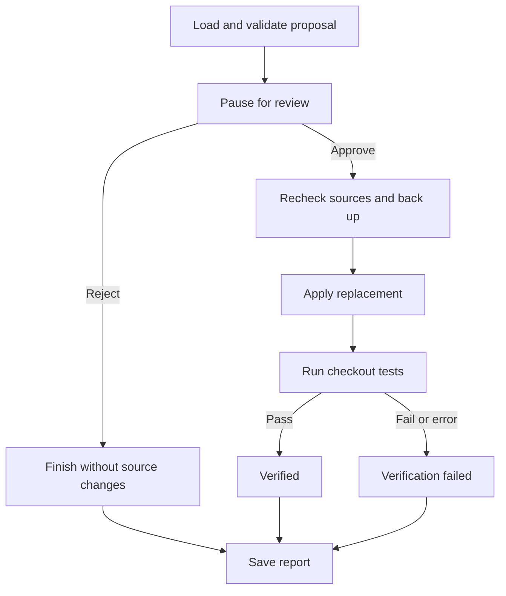

# Repository Debug Agent

**An agent-assisted Python debugging workflow built with LangChain, LangGraph, and Groq.**

Describe a repository bug, let an agent gather evidence through controlled tools, review a generated code change, and approve its application before running tests.

This project demonstrates one complete repair of a checkout discount bug. It combines an adaptive investigation agent with ordinary Python validation and an explicit human approval workflow.

> **Current status:** The demo checkout is repaired. Seven checkout tests and four file-tool tests passed in separate local runs. The project is a learning and portfolio implementation, not a production service for arbitrary repositories.

## The problem demonstrated

The demo checkout applied the same coupon twice: once directly in `checkout()` and again through `calculate_total()`.

For a subtotal of **100,000 paise** and `SAVE10`:

| Calculation | Payable amount |
| --- | ---: |
| Expected: one 10% discount | 90,000 paise |
| Original implementation: two successive 10% discounts | 81,000 paise |

Successive discounts compound: `100000 × 0.9 × 0.9 = 81000`, an effective 19% discount.

The agent traced the calls across `shop/checkout.py`, `shop/coupons.py`, and `shop/pricing.py`. The proposed fix removed the redundant discount application and unused import, leaving `calculate_total()` responsible for applying the coupon once.

## Features

- Repository investigation using file listing, line-numbered reads, text search, and pytest execution.
- Visible model tool requests and tool results in the terminal.
- One bounded continuation if an investigation ends with an empty model response.
- Structured patch proposals with a fixed target file and replacement source.
- Syntax checking, source hashes, and Python-generated diffs.
- Human approval or rejection using a LangGraph interrupt.
- Source revalidation and backup before application.
- Test verification and saved JSON repair reports.

## Where the agent adds value

The investigation path is not hardcoded. The model can inspect a failure, choose a relevant file or search, follow related function calls, and gather more evidence before explaining the cause.

The model requests tool calls; Python performs the actual repository operations. A fixed script could investigate this particular known bug, but the agent loop is useful for practicing investigations where the next useful action depends on newly discovered evidence.

The patch proposer is a **separate structured model call**, not another autonomous agent. Its inputs and task are already defined. Approval, file writes, and test verification use deterministic Python and LangGraph workflow steps.

## Architecture

| Component | Responsibility |
| --- | --- |
| Groq / `ChatGroq` | Supplies the chat model for investigation and proposal generation |
| LangChain `create_agent()` | Coordinates model decisions, tool calls, and returned evidence |
| Repository tools | Read approved files, search text, and execute approved tests |
| Pydantic proposal schema | Validates response fields and restricts the proposed target |
| Patch utilities | Check syntax, record source hashes, build diffs, and save proposals |
| LangGraph repair workflow | Pauses for review, routes the decision, applies, and verifies |

LangChain's agent runtime uses LangGraph internally. This project also defines a separate, explicit repair graph:



The approval decision is supplied through `Command(resume=...)` using the same workflow thread ID. `InMemorySaver` retains the paused state for the lifetime of that Python process.

## Project layout

Key implemented files are listed below; additional scaffold files may be present.

| Path | Purpose |
| --- | --- |
| `check_connection.py` | Verify the Groq connection |
| `main.py` | Run investigation and generate a proposal |
| `repair.py` | Review, apply, and verify a saved proposal |
| `agent/config.py` | Repository location and access limits |
| `agent/model.py` | Groq model configuration |
| `agent/investigator.py` | LangChain investigator and tool wrappers |
| `agent/tools/file_tools.py` | Approved file listing, reading, and search |
| `agent/tools/test_runner.py` | Controlled pytest subprocess |
| `agent/tools/patch_tools.py` | Proposal generation, validation, diff, backup, and application |
| `agent/workflows/state.py` | Repair state definition |
| `agent/workflows/nodes.py` | Review, application, and verification steps |
| `agent/workflows/graph.py` | Graph construction and conditional routing |
| `prompts/investigator.md` | Investigation instructions |
| `prompts/patch_proposer.md` | Patch-generation instructions |
| `demo_repo/README.md` | Checkout business requirements |
| `demo_repo/shop/` | Demo checkout implementation |
| `demo_repo/tests/test_checkout.py` | Checkout and coupon regression tests |
| `tests/test_file_tools.py` | File-tool tests |
| `patches/` | Generated proposals and source backups |
| `reports/` | Generated repair reports |

## Setup

### Prerequisites

- Python 3.12 is recommended to match the development environment.
- Git and a terminal; VS Code is optional.
- A Groq API key and access to a model supporting tool calling.
- Internet access for model calls and package installation.

Download or clone this repository, then open a terminal in its root directory.

### Install dependencies

Linux/macOS:

```bash
python -m venv .venv
source .venv/bin/activate
python -m pip install -r requirements.txt
```

The project was exercised locally on Linux. Windows users can activate the environment with `.venv\Scripts\Activate.ps1` in PowerShell; Windows execution has not been demonstrated here.

### Configure Groq

Create a `.env` file in the project root:

```dotenv
GROQ_API_KEY=replace_with_your_key
GROQ_MODEL=openai/gpt-oss-20b
```

`openai/gpt-oss-20b` was used for the demonstrated run. Model availability depends on the account and provider; use an accessible compatible model if needed.

Keep `.env` out of version control. Selected source contents and tool outputs are sent to Groq during model calls.

Check the connection:

```bash
python check_connection.py
```

## Usage

### 1. Investigate and propose

From the project root:

```bash
python main.py
```

This uses the checkout issue currently defined in `main.py`. It displays tool requests and results, followed by an investigation report and a proposed diff.

A proposal is saved under `patches/proposal_<id>.json`. Source files are not modified during proposal generation.

**Important:** The checkout bug is already repaired in the current source. Rerunning the same issue is not a fresh reproduction of the original failure. The pipeline does not yet implement a dedicated `no_fix_needed` outcome. To repeat a full repair demonstration, use a separate disposable checkout containing an intentionally failing fixture and generate a fresh proposal there. No fixture-reset command is included in this version.

### 2. Review a saved proposal

Replace `proposal_<id>.json` with an actual newly generated filename:

```bash
python repair.py patches/proposal_<id>.json
```

Review the explanation and recomputed diff:

- Type `yes` to back up the original file, apply the change, and run checkout tests.
- Any other answer rejects the proposal and finishes without source changes.

Repair uses the saved proposal and makes no additional Groq calls. It does execute the local demo code through pytest after approval.

### 3. Inspect results

| Status | Meaning |
| --- | --- |
| `rejected` | The proposal was declined |
| `verified` | The change was applied and the configured checkout test file passed |
| `verification_failed` | The change was applied, but test execution failed, errored, or timed out |

Original source backups are saved under `patches/backups/`. Completed repair runs save JSON reports under `reports/`. These runtime files are generated locally and need not be committed.

If verification fails, the proposed code **remains applied**. The backup is available for manual recovery; automatic rollback is not implemented. Exceptions during validation or application may stop execution before a report is saved.

## Testing and observed results

Run file-tool tests from the project root:

```bash
python -m pytest tests/test_file_tools.py -q
```

Run checkout tests from the demo repository:

```bash
cd demo_repo
python -m pytest tests/test_checkout.py -q
cd ..
```

The directories matter because the demo imports `shop` from its own repository root.

| Local check | Observed result |
| --- | --- |
| Original checkout before repair | 1 failed, 3 passed |
| Checkout immediately after approved repair | 4 passed |
| Checkout after regression additions | 7 passed |
| File tools | 4 passed |

The seven checkout cases cover no coupon, multiple items, SAVE10, unknown coupons, SAVE20, and fractional-paise discount rounding for both supported coupons. Coupon cases also assert that the subtotal remains unchanged.

Discount rounding examples:

| Coupon | Subtotal | Rounded-down discount | Expected total |
| --- | ---: | ---: | ---: |
| SAVE20 | 100000 | 20000 | 80000 |
| SAVE10 | 999 | 99 | 900 |
| SAVE20 | 999 | 199 | 800 |

The earlier repair report records four passing tests because the additional cases were added afterward. These are reported local results, not CI badges or a claim of automated coverage for the entire agent workflow.

## Controls and limitations

- **Bounded access:** File tools use an allowlist, size limits, and line limits. Patch proposals target only `shop/checkout.py`.
- **Bounded execution:** Tests use a fixed argument list, selected environment variables, a timeout, and truncated returned output. Output is captured before truncation, so the display cap is not a process-memory limit.
- **Source checks:** Hashes for the recorded source context are checked before review and application. Editing any recorded source file, including tests or the demo README, invalidates an old proposal.
- **Syntax versus behavior:** Parsing generated Python checks syntax. It does not establish correctness or safety; prompt rules such as preserving interfaces are not all enforced automatically.
- **Local execution:** The test runner is not an OS sandbox. Generated code runs with the user's permissions. This version is intended for the controlled demo.
- **Review quality:** Reports can contain unsupported claims. The model has previously returned empty responses and misstated test coverage; inspect the actual evidence.
- **Persistence:** The in-memory checkpointer cannot resume a paused run after the process exits.
- **Application:** File application assumes one local user without concurrent changes. It is not transactional or crash-safe.
- **Evaluation:** One bug has been repaired end to end. Passing seven checkout cases does not establish reliability on arbitrary repositories.

## Troubleshooting

| Symptom | Action |
| --- | --- |
| `GROQ_API_KEY` missing | Check the root `.env` file |
| Model unavailable | Select a tool-calling model available to your Groq account |
| Empty investigation response | One bounded continuation is attempted; inspect the trace if it remains incomplete |
| Test file not found or `shop` import error | Run the command from the directory specified in Testing |
| Source hash mismatch | Generate and review a fresh proposal for the current source; do not bypass the check |
| No-change proposal rejected | Check whether the reported bug is already fixed |
| Verification failed | Read the actual pytest output and inspect the applied code and backup |

## Learning outcomes

- Distinguishing an adaptive agent loop from a fixed model call.
- Designing tools with bounded inputs and evidence-bearing outputs.
- Using structured responses to make model output programmatically inspectable.
- Managing state, branching, interrupts, and resume decisions with LangGraph.
- Separating a suggested fix from an applied and tested change.
- Recognizing that successful model output still requires validation.

## Future work

- Automated tests for rejection, stale proposals, application errors, and failed verification.
- A reproducible failing fixture and a dedicated no-fix-needed path.
- Persistent checkpoint storage and restartable runs.
- Isolated test execution and controlled rollback.
- Evidence checks for file references and test-coverage claims.
- Evaluation on multiple independent bugs before expanding repository scope.

## References

- [LangChain agents](https://docs.langchain.com/oss/python/langchain/agents)
- [LangChain tools](https://docs.langchain.com/oss/python/langchain/tools)
- [ChatGroq integration](https://docs.langchain.com/oss/python/integrations/chat/groq)
- [LangGraph interrupts](https://docs.langchain.com/oss/python/langgraph/interrupts)
- [pytest documentation](https://docs.pytest.org/en/stable/)

## License

No license is specified in this README. Add a `LICENSE` file with your chosen terms before advertising the repository as open source.
